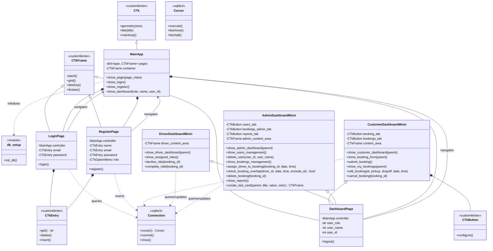

# Bedfordshire Taxi Booking System - Class Diagram

## PlantUML Diagram

```plantuml
@startuml Bedfordshire_Taxi_Booking_System

!define PRIMARY_COLOR #FFD700
!define SECONDARY_COLOR #1A1F2E
!define TEXT_COLOR #E2E8F0

skinparam class {
    BackgroundColor SECONDARY_COLOR
    BorderColor PRIMARY_COLOR
    ArrowColor PRIMARY_COLOR
    FontColor TEXT_COLOR
}

skinparam note {
    BackgroundColor #2D3748
    BorderColor PRIMARY_COLOR
    FontColor TEXT_COLOR
}

' ============================================
' External Libraries
' ============================================

package "customtkinter" <<Library>> {
    abstract class CTk {
        +geometry(size: str)
        +title(title: str)
        +resizable(width: bool, height: bool)
        +mainloop()
        +wm_iconbitmap()
        +iconphoto(default: bool, image: PhotoImage)
    }
    
    abstract class CTkFrame {
        +pack(fill: str, expand: bool, ...)
        +grid(row: int, column: int, ...)
        +grid_rowconfigure(index: int, weight: int)
        +grid_columnconfigure(index: int, weight: int)
        +winfo_children()
        +destroy()
        +tkraise()
    }
    
    abstract class CTkLabel {
        +pack(...)
        +configure(**kwargs)
        +bind(event: str, callback: Callable)
    }
    
    abstract class CTkEntry {
        +pack(...)
        +get(): str
        +delete(start: int, end: str)
        +insert(index: int, text: str)
    }
    
    abstract class CTkButton {
        +pack(...)
        +configure(**kwargs)
    }
    
    abstract class CTkOptionMenu {
        +pack(...)
        +set(value: str)
        +get(): str
    }
    
    abstract class CTkScrollableFrame {
        +pack(...)
    }
    
    abstract class CTkTextbox {
        +pack(...)
        +insert(index: str, text: str)
        +get(start: str, end: str): str
    }
    
    abstract class CTkToplevel {
        +transient(parent: CTk)
        +grab_set()
        +destroy()
    }
    
    class CTkFont {
        +family: str
        +size: int
        +weight: str
        +__init__(family: str, size: int, weight: str)
    }
}

package "sqlite3" <<Library>> {
    class Connection {
        +cursor(): Cursor
        +commit()
        +close()
    }
    
    class Cursor {
        +execute(query: str, params: tuple)
        +fetchone(): tuple | None
        +fetchall(): list[tuple]
    }
}

package "tkinter" <<Library>> {
    class messagebox <<static>> {
        +showinfo(title: str, message: str)
        +showerror(title: str, message: str)
        +showwarning(title: str, message: str)
        +askyesno(title: str, message: str): bool
    }
}

package "PIL" <<Library>> {
    class Image {
        +open(path: str): Image
        +thumbnail(size: tuple, resample: int)
        +width: int
        +height: int
    }
    
    class ImageTk {
        +PhotoImage(file: str): PhotoImage
    }
}

package "datetime" <<Library>> {
    class datetime {
        +strptime(date_string: str, format: str): datetime
        +__add__(delta: timedelta): datetime
        +__lt__(other: datetime): bool
    }
    
    class timedelta {
        +__init__(hours: int, ...)
    }
}

' ============================================
' Database Module
' ============================================

package "Database" <<Module>> {
    class db_setup <<module>> {
        +init_db(): void
        --
        Creates database tables:
        - users
        - bookings
        Performs migrations
    }
    
    note right of db_setup
        **Database Schema:**
        
        **users**
        - id INTEGER PK
        - email TEXT UNIQUE
        - password TEXT
        - role TEXT
        - name TEXT
        - address TEXT
        - phone TEXT
        
        **bookings**
        - id INTEGER PK
        - user_id INTEGER FK → users(id)
        - driver_id INTEGER FK → users(id)
        - pickup_location TEXT
        - dropoff_location TEXT
        - booking_date TEXT
        - booking_time TEXT
        - status TEXT
        - created_at TIMESTAMP
    end note
}

' ============================================
' Main Application
' ============================================

package "Application Core" <<Module>> {
    class MainApp {
        -container: CTkFrame
        -pages: dict[type, CTkFrame]
        -iconpath: PhotoImage
        +__init__()
        +show_page(page_class: type)
        +show_login()
        +show_register()
        +show_dashboard(role: str, name: str, user_id: int)
    }
    
    note right of MainApp
        **Navigation Controller**
        
        Manages page transitions using
        frame stacking pattern.
        
        Pages are created and gridded
        to same location, then raised
        to front with tkraise().
        
        Dashboard is recreated on each
        login to ensure fresh state.
    end note
}

' ============================================
' Authentication Pages
' ============================================

package "Authentication" <<Module>> {
    class LoginPage {
        -controller: MainApp
        -email: CTkEntry
        -password: CTkEntry
        +__init__(parent: CTkFrame, controller: MainApp)
        +login()
        --
        **UI Components:**
        - Left panel: Branding (golden yellow)
        - Right panel: Login form (white)
        - Email entry
        - Password entry (masked)
        - Remember me checkbox
        - Login button
        - Sign up link
    }
    
    class RegisterPage {
        -controller: MainApp
        -name: CTkEntry
        -address: CTkEntry
        -phone: CTkEntry
        -email: CTkEntry
        -password: CTkEntry
        -role: CTkOptionMenu
        +__init__(parent: CTkFrame, controller: MainApp)
        +register()
        --
        **UI Components:**
        - Left panel: Branding
        - Right panel: Registration form
        - All user fields
        - Role dropdown (Customer/Driver/Admin)
        - Create account button
        - Login link
    }
    
    note bottom of LoginPage
        **Authentication Flow:**
        
        1. Validate input (non-empty, email format)
        2. Query: SELECT role, id, name 
           FROM users 
           WHERE email=? AND password=?
        3. If found, navigate to dashboard
        4. Pass user context (role, name, id)
    end note
    
    note bottom of RegisterPage
        **Registration Flow:**
        
        1. Validate all fields
        2. Check email format
        3. Validate password length (≥6)
        4. Validate phone length (≥10)
        5. INSERT INTO users
        6. Handle IntegrityError (duplicate email)
        7. Navigate to login page
    end note
}

' ============================================
' Dashboard System
' ============================================

package "Dashboard System" <<Module>> {
    class DashboardPage {
        -controller: MainApp
        -user_role: str
        -user_name: str
        -user_id: int
        +__init__(parent: CTkFrame, controller: MainApp, \\n        role: str, name: str, user_id: int)
        +logout()
        --
        **UI Structure:**
        - Header (role-specific title, logout button)
        - Scrollable content area
        - Dispatches to role-specific mixin
    }
    
    class CustomerDashboardMixin {
        -booking_tab: CTkButton
        -bookings_tab: CTkButton
        -content_area: CTkFrame
        -pickup_entry: CTkEntry
        -dropoff_entry: CTkEntry
        -date_entry: CTkEntry
        -time_entry: CTkEntry
        +show_customer_dashboard(parent: CTkFrame)
        +show_booking_form(parent: CTkFrame)
        +submit_booking()
        +show_my_bookings(parent: CTkFrame)
        +edit_booking(id: int, pickup: str, \\n               dropoff: str, date: str, time: str)
        +cancel_booking(booking_id: int)
        --
        **Features:**
        - Tab navigation (Book a Ride / My Bookings)
        - Booking form with date/time validation
        - List bookings with status colors
        - Edit/cancel pending bookings
        - Modal dialog for editing
    }
    
    class DriverDashboardMixin {
        -driver_content_area: CTkFrame
        +show_driver_dashboard(parent: CTkFrame)
        +show_assigned_rides()
        +decline_ride(booking_id: int)
        +complete_ride(booking_id: int)
        --
        **Features:**
        - View assigned rides
        - Display customer name & phone
        - Decline ride (with reason)
        - Mark ride as completed
        - Unassigns driver on decline
    }
    
    class AdminDashboardMixin {
        -users_tab: CTkButton
        -bookings_admin_tab: CTkButton
        -reports_tab: CTkButton
        -admin_content_area: CTkFrame
        +show_admin_dashboard(parent: CTkFrame)
        +show_users_management()
        +delete_user(user_id: int, user_name: str)
        +show_bookings_management()
        +assign_driver_to_booking(booking_id: int, \\n                          date: str, time: str)
        +check_booking_overlap(driver_id: int, date: str, \\n                       time: str, exclude_id: int): bool
        +delete_booking(booking_id: int)
        +show_reports()
        +create_stat_card(parent: CTkFrame, title: str, \\n                  value: str, color: str): CTkFrame
        --
        **Features:**
        - Three-tab layout (Users/Bookings/Reports)
        - User management (list, delete)
        - Booking management (list, assign driver, delete)
        - Driver assignment with overlap detection
        - Statistics dashboard (counts & status)
        - Cascade delete (bookings → user)
    }
    
    note right of AdminDashboardMixin
        **Overlap Detection Algorithm:**
        
        1. Query driver's bookings for same date
        2. Exclude current booking (if editing)
        3. Assume 1-hour ride duration
        4. For each existing booking:
           - Calculate time ranges
           - Check if ranges overlap:
             new_start < existing_end AND
             existing_start < new_end
        5. Return true if any overlap found
        
        Prevents double-booking drivers
    end note
}

' ============================================
' Relationships
' ============================================

' Inheritance
CTk <|-- MainApp
CTkFrame <|-- LoginPage
CTkFrame <|-- RegisterPage
CTkFrame <|-- DashboardPage

CustomerDashboardMixin <|-- DashboardPage
DriverDashboardMixin <|-- DashboardPage
AdminDashboardMixin <|-- DashboardPage

' Composition
MainApp *-- LoginPage : creates/manages
MainApp *-- RegisterPage : creates/manages
MainApp *-- DashboardPage : creates/manages

LoginPage *-- CTkEntry : contains
LoginPage *-- CTkButton : contains
LoginPage *-- CTkLabel : contains

RegisterPage *-- CTkEntry : contains
RegisterPage *-- CTkButton : contains
RegisterPage *-- CTkOptionMenu : contains

DashboardPage *-- CTkScrollableFrame : contains
CustomerDashboardMixin *-- CTkEntry : contains
CustomerDashboardMixin *-- CTkButton : contains

' Dependencies
MainApp ..> db_setup : calls init_db()
LoginPage ..> messagebox : shows dialogs
RegisterPage ..> messagebox : shows dialogs
CustomerDashboardMixin ..> messagebox : shows dialogs
DriverDashboardMixin ..> messagebox : shows dialogs
AdminDashboardMixin ..> messagebox : shows dialogs

LoginPage ..> Connection : queries database
RegisterPage ..> Connection : inserts to database
CustomerDashboardMixin ..> Connection : queries/updates database
DriverDashboardMixin ..> Connection : queries/updates database
AdminDashboardMixin ..> Connection : queries/updates database

MainApp ..> Image : loads icons
LoginPage ..> Image : loads logo
RegisterPage ..> Image : loads logo

CustomerDashboardMixin ..> datetime : validates dates
AdminDashboardMixin ..> datetime : checks overlaps
AdminDashboardMixin ..> timedelta : calculates duration

' Associations
LoginPage --> MainApp : navigates via
RegisterPage --> MainApp : navigates via
DashboardPage --> MainApp : navigates via

CustomerDashboardMixin ..> CTkToplevel : creates modals
DriverDashboardMixin ..> CTkToplevel : creates modals
AdminDashboardMixin ..> CTkToplevel : creates modals

' Database relationships
db_setup ..> Connection : creates tables
db_setup ..> Cursor : executes DDL

@enduml
```

## Mermaid Diagram (Alternative)



## Simplified Component Diagram

```
┌──────────────────────────────────────────────────────────────┐
│                         MainApp                              │
│                    (Navigation Controller)                   │
│  ┌────────────────────────────────────────────────────────┐  │
│  │                  Container Frame                        │  │
│  │                                                         │  │
│  │  ┌─────────────────────────────────────────────────┐   │  │
│  │  │              LoginPage                          │   │  │
│  │  │  [Email Entry] [Password Entry] [Login Button]  │   │  │
│  │  └─────────────────────────────────────────────────┘   │  │
│  │                                                         │  │
│  │  ┌─────────────────────────────────────────────────┐   │  │
│  │  │              RegisterPage                        │   │  │
│  │  │  [Name] [Address] [Phone] [Email] [Password]    │   │  │
│  │  │  [Role Dropdown] [Register Button]              │   │  │
│  │  └─────────────────────────────────────────────────┘   │  │
│  │                                                         │  │
│  │  ┌─────────────────────────────────────────────────┐   │  │
│  │  │            DashboardPage                        │   │  │
│  │  │  ┌──────────────────────────────────────────┐   │   │  │
│  │  │  │  Header: [Title] [Logout Button]        │   │   │  │
│  │  │  └──────────────────────────────────────────┘   │   │  │
│  │  │  ┌──────────────────────────────────────────┐   │   │  │
│  │  │  │  CustomerDashboardMixin (if customer)    │   │   │  │
│  │  │  │    - Book a Ride Tab                     │   │   │  │
│  │  │  │    - My Bookings Tab                     │   │   │  │
│  │  │  └──────────────────────────────────────────┘   │   │  │
│  │  │  ┌──────────────────────────────────────────┐   │   │  │
│  │  │  │  DriverDashboardMixin (if driver)        │   │   │  │
│  │  │  │    - Assigned Rides List                 │   │   │  │
│  │  │  │    - Decline/Complete Buttons            │   │   │  │
│  │  │  └──────────────────────────────────────────┘   │   │  │
│  │  │  ┌──────────────────────────────────────────┐   │   │  │
│  │  │  │  AdminDashboardMixin (if admin)          │   │   │  │
│  │  │  │    - Users Tab                           │   │   │  │
│  │  │  │    - Bookings Tab                        │   │   │  │
│  │  │  │    - Reports Tab                         │   │   │  │
│  │  │  └──────────────────────────────────────────┘   │   │  │
│  │  └─────────────────────────────────────────────────┘   │  │
│  └────────────────────────────────────────────────────────┘  │
└──────────────────────────────────────────────────────────────┘
                            │
                            │ uses
                            ▼
                    ┌───────────────┐
                    │  SQLite3 DB   │
                    │   (taxi.db)   │
                    │               │
                    │  ┌─────────┐  │
                    │  │  users  │  │
                    │  └─────────┘  │
                    │       │       │
                    │       │       │
                    │  ┌─────────┐  │
                    │  │bookings │  │
                    │  └─────────┘  │
                    └───────────────┘
```

## Database Entity-Relationship Diagram

```
┌─────────────────────────────────┐
│            users                │
├─────────────────────────────────┤
│ PK  id (INTEGER)                │
│     email (TEXT) UNIQUE         │
│     password (TEXT)             │
│     role (TEXT)                 │
│     name (TEXT)                 │
│     address (TEXT)              │
│     phone (TEXT)                │
└─────────────────────────────────┘
            │
            │ 1
            │
            │
            │ N
┌─────────────────────────────────┐
│           bookings              │
├─────────────────────────────────┤
│ PK  id (INTEGER)                │
│ FK  user_id (INTEGER) ──────────┼──> users.id (customer)
│ FK  driver_id (INTEGER) ────────┼──> users.id (driver)
│     pickup_location (TEXT)      │
│     dropoff_location (TEXT)     │
│     booking_date (TEXT)         │
│     booking_time (TEXT)         │
│     status (TEXT)               │
│     created_at (TIMESTAMP)      │
└─────────────────────────────────┘

Relationships:
- One user (customer) can have many bookings
- One user (driver) can be assigned to many bookings
- One booking belongs to one customer (user_id)
- One booking may be assigned to one driver (driver_id, nullable)

Status Values:
- 'pending': Booking created, no driver assigned
- 'assigned': Driver assigned to booking
- 'completed': Ride finished
- 'cancelled': Booking cancelled by customer

Role Values:
- 'Customer': Can create and manage bookings
- 'Driver': Can view assigned rides and update status
- 'Admin': Can manage users, assign drivers, view reports
```

## Class Interaction Sequence Diagrams

### Login Sequence

```
User          LoginPage      Connection      MainApp       DashboardPage
 │                │              │              │                │
 │  Enter creds  │              │              │                │
 │──────────────>│              │              │                │
 │                │              │              │                │
 │  Click Login  │              │              │                │
 │──────────────>│              │              │                │
 │                │ connect()    │              │                │
 │                │─────────────>│              │                │
 │                │              │              │                │
 │                │ execute(SELECT)             │                │
 │                │─────────────>│              │                │
 │                │              │              │                │
 │                │ fetchone()   │              │                │
 │                │<─────────────│              │                │
 │                │              │              │                │
 │                │ close()      │              │                │
 │                │─────────────>│              │                │
 │                │                             │                │
 │                │ show_dashboard(role, name, id)              │
 │                │────────────────────────────>│                │
 │                │                             │                │
 │                │                             │ __init__()     │
 │                │                             │───────────────>│
 │                │                             │                │
 │                │                             │  show_X_dashboard()
 │                │                             │<───────────────│
 │                │                             │                │
 │                │                             │ tkraise()      │
 │                │                             │───────────────>│
 │                │                             │                │
 │   Dashboard Displayed                       │                │
 │<─────────────────────────────────────────────────────────────│
```

### Customer Booking Sequence

```
Customer   CustomerMixin   Connection   DashboardPage
   │            │              │              │
   │  Fill form │              │              │
   │───────────>│              │              │
   │            │              │              │
   │  Submit    │              │              │
   │───────────>│              │              │
   │            │              │              │
   │            │ validate()   │              │
   │            │──────────────│              │
   │            │              │              │
   │            │ connect()    │              │
   │            │─────────────>│              │
   │            │              │              │
   │            │ execute(INSERT)             │
   │            │─────────────>│              │
   │            │              │              │
   │            │ commit()     │              │
   │            │─────────────>│              │
   │            │              │              │
   │            │ close()      │              │
   │            │─────────────>│              │
   │            │              │              │
   │            │ messagebox.showinfo()       │
   │            │────────────────────────────>│
   │            │              │              │
   │  Success   │              │              │
   │<───────────│              │              │
```

### Admin Assign Driver Sequence

```
Admin    AdminMixin   Connection   CTkToplevel
  │          │            │             │
  │  Click   │            │             │
  │ "Assign" │            │             │
  │─────────>│            │             │
  │          │            │             │
  │          │ connect()  │             │
  │          │───────────>│             │
  │          │            │             │
  │          │ SELECT drivers           │
  │          │───────────>│             │
  │          │            │             │
  │          │ fetchall() │             │
  │          │<───────────│             │
  │          │            │             │
  │          │ close()    │             │
  │          │───────────>│             │
  │          │                          │
  │          │ create modal             │
  │          │─────────────────────────>│
  │          │                          │
  │  Select  │                          │
  │  Driver  │                          │
  │─────────────────────────────────────>│
  │          │                          │
  │  Confirm │                          │
  │─────────────────────────────────────>│
  │          │                          │
  │          │ check_overlap()          │
  │          │<─────────────────────────│
  │          │            │             │
  │          │ connect()  │             │
  │          │───────────>│             │
  │          │            │             │
  │          │ SELECT overlapping       │
  │          │───────────>│             │
  │          │            │             │
  │          │ fetchall() │             │
  │          │<───────────│             │
  │          │            │             │
  │          │ (no overlap)             │
  │          │            │             │
  │          │ UPDATE booking           │
  │          │───────────>│             │
  │          │            │             │
  │          │ commit()   │             │
  │          │───────────>│             │
  │          │            │             │
  │          │ close()    │             │
  │          │───────────>│             │
  │          │                          │
  │          │ destroy()                │
  │          │─────────────────────────>│
  │          │                          │
  │          │ refresh_list()           │
  │          │──────────────            │
  │          │             │            │
  │  Updated │             │            │
  │  List    │             │            │
  │<─────────│             │            │
```

## Key Design Patterns Used

### 1. Multiple Inheritance (Mixin Pattern)
```python
class DashboardPage(
    CustomerDashboardMixin,
    DriverDashboardMixin,
    AdminDashboardMixin,
    CTkFrame
):
    pass
```
**Purpose**: Share functionality across classes without deep inheritance hierarchies

### 2. Frame Stacking Navigation
```python
# Create all pages at same grid location
for page in pages:
    page.grid(row=0, column=0, sticky="nsew")

# Show specific page
target_page.tkraise()
```
**Purpose**: Simple page navigation without destroying/recreating widgets

### 3. Repository Pattern (Implicit)
Each component directly accesses the database using consistent patterns:
```python
conn = sqlite3.connect("taxi.db")
cur = conn.cursor()
cur.execute("SELECT ...", (params,))
result = cur.fetchall()
conn.close()
```
**Purpose**: Direct data access without abstraction layer

### 4. Modal Dialog Pattern
```python
dialog = CTkToplevel(parent)
dialog.transient(parent)
dialog.grab_set()
# ... content ...
dialog.destroy()
```
**Purpose**: Block parent interaction until dialog closes

### 5. Observer Pattern (Implicit via Callbacks)
```python
button = CTkButton(parent, command=self.callback)
widget.bind("<Event>", handler)
```
**Purpose**: Respond to user interactions

### 6. Factory Pattern (Implicit)
```python
def create_stat_card(self, parent, title, value, color):
    card = CTkFrame(parent, ...)
    # ... add labels ...
    return card
```
**Purpose**: Create consistent UI components

## Component Responsibilities

### MainApp
- **Primary**: Window management and navigation
- **Secondary**: Page lifecycle management
- **Dependencies**: All page classes, db_setup

### LoginPage / RegisterPage
- **Primary**: User authentication and registration
- **Secondary**: Input validation
- **Dependencies**: MainApp (navigation), sqlite3 (persistence)

### DashboardPage
- **Primary**: Role-based dashboard container
- **Secondary**: Common header and layout
- **Dependencies**: MainApp (navigation), Mixins (functionality)

### CustomerDashboardMixin
- **Primary**: Customer booking management
- **Secondary**: Booking CRUD operations
- **Dependencies**: sqlite3 (persistence), datetime (validation)

### DriverDashboardMixin
- **Primary**: Driver ride management
- **Secondary**: Ride status updates
- **Dependencies**: sqlite3 (persistence)

### AdminDashboardMixin
- **Primary**: System administration
- **Secondary**: User management, driver assignment, reporting
- **Dependencies**: sqlite3 (complex queries), datetime (overlap detection)

### db_setup
- **Primary**: Database initialization
- **Secondary**: Schema migrations
- **Dependencies**: sqlite3

## Coupling and Cohesion Analysis

### Strong Coupling (Areas of Concern)
- All components tightly coupled to SQLite schema
- Mixins tightly coupled to CustomTkinter
- Direct SQL queries throughout (no abstraction)

### High Cohesion (Well-Designed)
- Each mixin focuses on single role's functionality
- Clear separation between authentication and dashboard
- Database module isolated for initialization

### Recommendations
1. **Add Data Access Layer**: Decouple database schema from UI
2. **Configuration Class**: Centralize database path and constants
3. **View Models**: Separate data structures from UI components
4. **Dependency Injection**: Pass database connection as parameter

---

## Summary

This class diagram illustrates:
- **9 main classes** (excluding libraries)
- **Multiple inheritance** for role-based functionality
- **Frame stacking** for navigation
- **Direct database access** pattern
- **Modal dialogs** for edit operations
- **Component-based UI** construction

The architecture is straightforward and appropriate for a desktop application, with clear separation of concerns between authentication, navigation, and role-specific functionality. The mixin pattern elegantly handles the three different user roles without code duplication.
